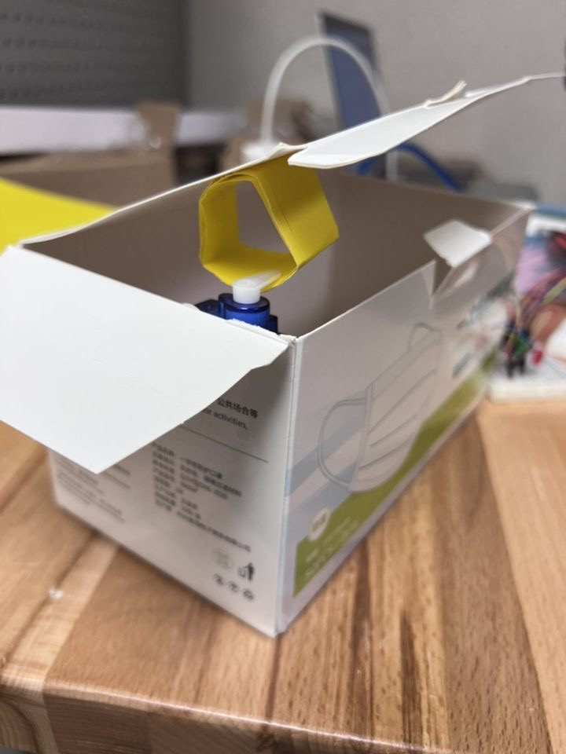

<h1>CSC 332 - Project #1</h1>

**Echo Hsiao and Raniery Mendes**
**Project Development**

To be able to develop our project prototype we relied mostly on two &quot;tutorials&quot;/repositories one from the Arduino Project Hub and another one from the Arduino Get Started platform. Respectively, the [Arduino RFID Servo Box](https://create.arduino.cc/projecthub/arcaegecengiz/arduino-rfid-servo-box-4361f1) and the [​​Arduino - RFID/NFC - Servo Motor.](https://arduinogetstarted.com/tutorials/arduino-rfid-nfc-servo-motor) While the latter assisted us with our initial idea of using an RFID reader as our sensor together with a servo motor as our major actuator, the former was critical to helping us design our prototype as well as figure out how we could use a servo motor as a locker. Furthermore, we point out that we also utilized some of the information provided by a tutorial on the [Random Nerd portal](https://randomnerdtutorials.com/security-access-using-mfrc522-rfid-reader-with-arduino/), so that we could better comprehend how to use an RFID reader, particularly the MFRC522.

Diving into the devices and pieces of equipment, we used a medium-size breadboard, an Arduino board, a servo motor, an RFID sensor module (Mifare RC522), some wires, an NFC ta two LED lights, a small cardboard box, and a piece of colored Cardstock.

Pictures of our prototype:

 

Moving into the logic and coding section of our project, first of all, we had to download and install the MFRC522 library into our Arduino to be able to connect and use the RFID sensor. Thanks to that we could run one of the simple example sketches available in that library to obtain the NFC tag&#39;s UID, which would be later used in our prototype. Since we were working with a servo motor and that RFID sensor we had to include the following header files in our code: SPI.h; MFRC522.h; and Servo.h.

The way our code and prototype works is that our loop keeps trying to sensor(find) a new card/tag to read, once it finds that, the program verifies whether it is a tag or card, whose UID is authorized or not. If it is, it will check the servo motor&#39;s current angle value, which in our case translates into the box being locked or unlocked, and perform the update of such value to change the angle value of the servo motor. It is important to note that, along with the servo motor action, the authorized UID also translates into the switching of LEDs on, that is, when the box is locked the green LED is off while the red one is on, while when the box is unlocked the opposite occurs.

Interestingly, we opted for maintaining a suggestion from the tutorial that recommended having an if statement right at the beginning of the loop, such that if there is no card, the loop just resets, saving some resources (power and time).

Here is a full demonstration of how our prototype works:

Moreover, in order to show the goal of our project, we decided to only add the tag&#39;s UID as an authorized tag. By doing that we aimed to demonstrate the safety aspect behind our locker, that is, only the person who is supposed to have access to the box/locker will be able to unlock it. Other cards or tags will fail to do so. Below there is a mini demo of this.

**Issues and Future Improvements**

Although our prototype is already functional, we faced some challenges while building it and we believe that it would be important to fully address them to have a sort of improved final product. We see that our major problem was wiring the MFRC522 RFID sensor module. Even when using the male-female wires, we had connection problems multiple times. We attempted to sort of tape it in a way it would not move but it was not possible to ensure the seven wired pins going into the module were halted at all times. Thus, the way we could partially solve this problem was by finding a perfect spot in which the sensor module would properly work and read the tag. However, it was complicated to keep that position for long periods of time, so it took us a large amount of time to put our entire prototype working together because the MFRC522 RFID would &quot;lose&quot; connection/power in terms of seconds and we would have to start over.

Furthermore, for our prototype, we used a cardboard box and a piece of cardstock to build its structural part. It definitely worked quite well for a first prototype, however, we discussed and we believe that a possible next step would be designing the box and the locker hook with precise measurements so that we could 3D-print them. Indeed, doing that would even allow us to integrate the RFID sensor directly into the locker/box, so it would no longer be an external piece. Also, 3D-printing the structure gives us the opportunity to design a box lid that the person just leaves the door close and scans the tag to lock it - different from our current prototype that requires the person to push down the lid and scan the tag to lock the box. Finally, we foresee that two other enhancements would be to get an even smaller Arduino board, once it would help us in reducing the size of the prototype and make it more user-friendly; and add the battery power module, so the system does not need to be connected to a PC at all times. It will even make our prototype be a more portable &quot;product&quot;.
